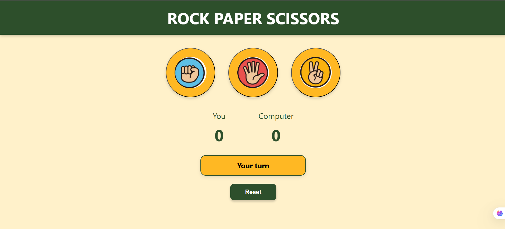

# 🪨 Rock Paper Scissors 🎮

A fun, responsive Rock Paper Scissors web game built with **HTML**, **CSS**, and **Vanilla JavaScript**.

>

## 🌟 Features

- 🎨 Clean, modern UI with smooth transitions and animations
- 🖱️ Interactive buttons for Rock, Paper, and Scissors
- 🤖 Random computer move generation
- 📊 Real-time scoring for user and computer
- ✨ Dynamic result messages with smooth fading
- 🔁 Reset button to restart the game anytime

## 💻 Technologies Used

- **HTML5** – Structure and layout  
- **CSS3** – Styling, transitions, responsiveness  
- **JavaScript (ES6)** – Game logic and DOM updates

🚀 Live Demo
Play the game online:
🔗 https://batcoder-1.github.io/Rock-Paper-Scissors-/

Made by Naman Dadhich
Built as a frontend mini-project for fun and learning.